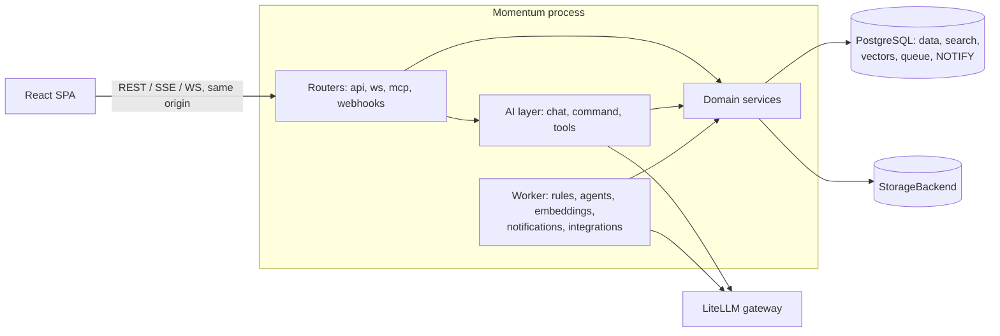

# Architecture Overview

## 1. Shape of the system

Momentum is a **modular monolith** shipped as **one container image**:

- **FastAPI** serves the REST API (`/api/v1`), WebSockets (`/ws`), SSE streams (AI), the MCP server (`/mcp`), webhooks (`/webhooks/*`), health (`/healthz`), and the **built React SPA** (same origin).
- **PostgreSQL 16** is the only stateful dependency: relational data, full-text search (`tsvector`, `pg_trgm`), vectors (`pgvector`), the job queue (Procrastinate), and realtime fan-out (`LISTEN/NOTIFY`).
- A **worker** (Procrastinate) runs rules, agents, embeddings, notifications, digests, and integrations. It runs embedded in the web process (`WORKER_MODE=embedded`) or as a separate process with the same image (`momentum worker`).
- **AI** goes through an OpenAI-compatible gateway (LiteLLM → Bedrock Claude, Cohere Embed v3).
- **Files** go through a `StorageBackend` (local filesystem; Azure Blob in Phase 9).



## 2. Backend package layout

```
apps/api/
├── pyproject.toml              # uv-managed; package name "momentum"
├── momentum/
│   ├── __init__.py             # exports create_app, mount_momentum, Settings (no side effects)
│   ├── app.py                  # create_app(settings) and mount_momentum(host_app, ...)
│   ├── cli.py                  # Typer CLI: serve, worker, migrate, seed, export, import, reindex, llm-check
│   ├── api/                    # app wiring: deps.py (get_ctx/get_uow), runtime.py, system.py (healthz, config)
│   ├── core/
│   │   ├── settings.py         # pydantic-settings, env prefix MOMENTUM_ (see configuration.md)
│   │   ├── db.py               # async engine/session factory, schema search_path, UoW helper
│   │   ├── ids.py              # uuid7 generation
│   │   ├── errors.py           # DomainError hierarchy → problem+json
│   │   ├── context.py          # RequestContext / Ctx (principal, workspace, request_id, dry_run)
│   │   ├── permissions.py      # can(), filters for queries
│   │   ├── activity.py         # record_activity(), undo registry
│   │   ├── events.py           # outbox write, event types, NOTIFY publisher
│   │   ├── ordering.py         # fractional index helpers
│   │   ├── telemetry.py        # structlog + OpenTelemetry setup (no-op exporter locally)
│   │   └── http.py             # request ids, CSRF guard, problem+json handlers
│   ├── auth/
│   │   ├── base.py             # AuthProvider protocol, Principal
│   │   ├── dev.py  easyauth.py  easyauth_sim.py  oidc.py  host.py  tokens.py
│   │   └── identity.py         # find-or-create user, link by email
│   ├── storage/                # base.py, local.py, azure_blob.py (P9)
│   ├── domain/
│   │   └── <module>/           # workspace, users, teams, projects, sections, tasks, fields, tags,
│   │       ├── models.py       # comments, attachments, activity, notifications, search, rules, forms,
│   │       ├── schemas.py      # templates, approvals, goals, dashboards, status_updates, portfolios
│   │       ├── service.py
│   │       ├── router.py
│   │       ├── queries.py      # read-side query builders (optional)
│   │       └── tools.py        # AI tool registrations for this module
│   ├── ai/
│   │   ├── llm.py              # gateway client (chat, stream, embed), usage logging, mock mode
│   │   ├── embeddings.py       # Cohere v3 input_type handling, chunking, batching
│   │   ├── tools/registry.py   # @tool decorator, schema export, dry-run execution
│   │   ├── context/            # context builders (task, project, user, workspace memory)
│   │   ├── prompts/            # versioned prompt templates (*.md / *.py)
│   │   ├── chat.py  command.py  actions.py   # Ask Mo, ⌘K parser, ai_actions lifecycle
│   │   └── evals/              # eval runner + fixtures
│   ├── agents/                 # models, runtime loop, triggers, scheduler, starter agent definitions
│   ├── jobs/                   # Procrastinate app, task definitions, periodic schedule
│   ├── realtime/               # WS hub, subscriptions, NOTIFY listener
│   ├── integrations/           # slack/, graph_calendar/, email_in/, asana_import/, csv_import/
│   ├── mcp/                    # FastMCP server exposing the tool registry
│   └── web/                    # SPA static serving + index.html fallback
│   ├── migrations/             # Alembic, inside the package so hosts get them too (version table in the Momentum schema)
└── tests/                      # unit/, integration/, api/, ai/, factories.py, conftest.py
```

## 3. Layering and dependency rules

```
routers / ws / mcp / webhooks / jobs / agents / ai
                 │  (call)
                 ▼
          domain services  ──►  core (db, permissions, activity, events, ordering)
                 │
                 ▼
            models (ORM)
```

| Rule | Detail |
|---|---|
| R1 | Only services write. Anything above services calls services; nothing below imports upward. |
| R2 | Services take `ctx: Ctx` as the first argument (principal, workspace, dry_run, request_id) and an `AsyncSession` via the unit of work. |
| R3 | Services raise `DomainError` subclasses (`NotFound`, `Forbidden`, `Conflict`, `ValidationFailed`); routers never build HTTP errors by hand. |
| R4 | Cross-module calls go service → service (e.g., `tasks.service` calls `projects.service.get_for_update`), never into another module's models directly for writes. |
| R5 | `ai/`, `agents/`, and `integrations/` depend on domain services. Domain never imports `ai/` (AI is a client of the domain, except `domain/*/tools.py` registration, which only imports the registry decorator). |
| R6 | No module-level state beyond constants. Settings, engine, and clients are created in `create_app()` and passed via `app.state` / dependencies. |

An import-linter config (`.importlinter`) enforces R1, R5, and R6 in `make check`.

## 4. Request lifecycle (mutation)

1. Auth middleware → `AuthProvider.authenticate()` → `Principal` → `identity.resolve_user()` → `Ctx`.
2. Router validates the body (Pydantic) → calls `service.update_task(ctx, task_id, patch)`.
3. The service opens the unit of work: loads with `SELECT … FOR UPDATE`, runs `can(ctx, "task.edit", task)`, applies changes, bumps `version`, calls `record_activity(...)` with `undo_payload`, calls `emit(event)` → outbox row. Commit.
4. After commit: `NOTIFY momentum_events, '<outbox_id>'` → WS hub fans out to subscribers. Procrastinate jobs are deferred for rules, notifications, and embeddings (the outbox dispatcher creates them).
5. The response returns the resource + `activity_id` + `version`.

**Dry-run mode** (`ctx.dry_run=True`): the same path runs inside a SAVEPOINT that's rolled back. The service returns the would-be diff. The AI preview uses this (see `ai/ai-architecture.md`).

## 5. Frontend overview

See `frontend/frontend-architecture.md`. The SPA is built into `apps/web/dist` and copied into the image. FastAPI serves it with an `index.html` fallback for client routes. In dev, Vite proxies `/api`, `/ws`, `/auth`, and `/dev` to the API.

## 6. Environments

| Env | Auth | DB | LLM | Storage | Where |
|---|---|---|---|---|---|
| `local` | `dev` or `easyauth-sim` | Docker Postgres | `mock` or any LiteLLM | local fs | Your machine (Phases 0–8) |
| `test` | `dev` (fixtures) | testcontainers Postgres | `mock` | tmp dir | `make check` |
| `production` | `easyauth` (or `host`/`oidc` when embedded elsewhere) | Azure PG Flexible | office LiteLLM | Azure Blob | Phase 9 |

## 7. Key ADRs

| ADR | Decision |
|---|---|
| 0001 | Modular monolith, single image, SPA served by FastAPI |
| 0002 | Postgres-only infrastructure (Procrastinate queue, NOTIFY realtime, pgvector) |
| 0003 | Pluggable auth with Easy Auth as the production provider |
| 0004 | OpenAI-compatible LLM gateway with model aliases |
| 0005 | Frontend stack and design language (Care Cockpit lineage) |
| 0006 | Embeddable module design (schema-scoped, mountable, env-prefixed) |
| 0007 | Fractional indexing for ordering |
| 0008 | AI actions: preview → confirm → apply → undo |
