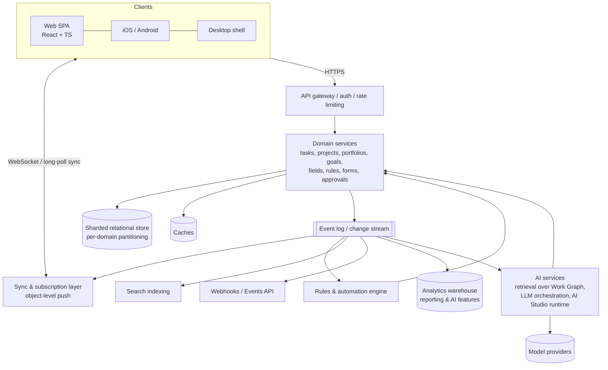
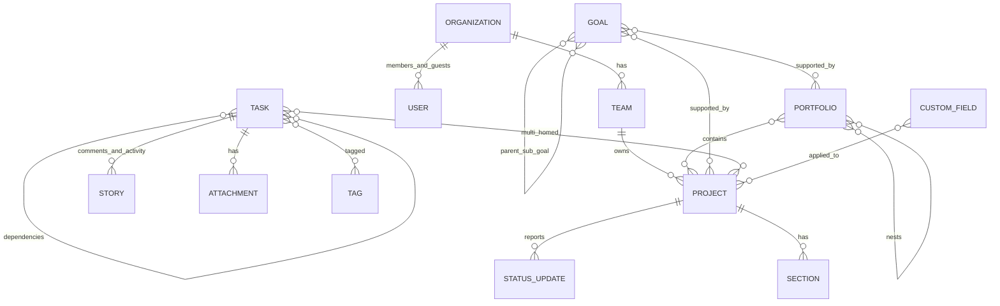
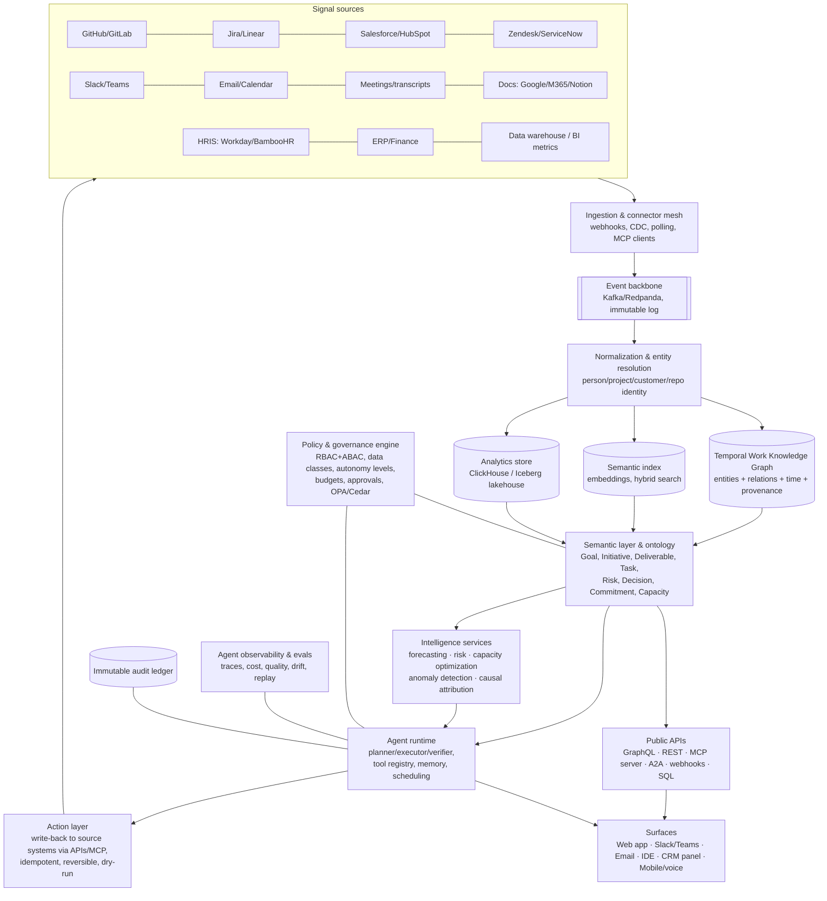
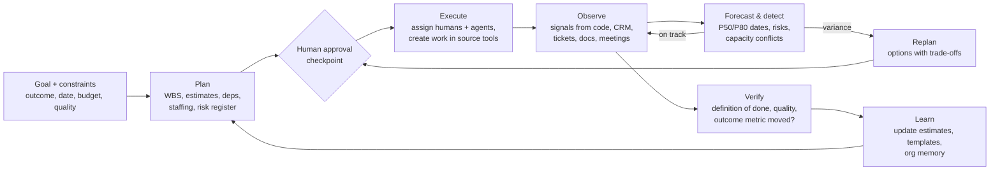

# Asana Deep Dive and the Blueprint for an AI-Native Work Operating System

*Analysis as of September 2026. Facts about Asana come from its public product, developer, and press materials (see Sources). Statements about Asana's internal implementation that Asana has not published are marked **(inferred)**.*

---

## Table of Contents

**Part I: Asana today**
1. Executive summary
2. Company and product context
3. Architecture and technology
4. Data model: the Work Graph
5. Full feature map by module
6. UX, interface design, and information architecture
7. Project, portfolio, and resource management
8. Workflow automation, approvals, forms, and templates
9. Reporting, dashboards, and goals
10. Collaboration features
11. AI capabilities (2023–2026)
12. Integrations and developer platform
13. Security, permissions, governance, compliance, and scale
14. Why Asana wins: competitive analysis

**Part II: Gaps**
15. Pain points by persona
16. Features users want that don't exist yet

**Part III: The AI-native Work OS**
17. Design principles
18. Reference architecture
19. The agent workforce
20. Autonomous project management, end to end
21. Advanced analytics, prediction, and optimization
22. What each persona gets
23. Ideas that go beyond Asana
24. Agent governance and trust
25. Can it beat Asana? Honest evaluation and strategy
26. Roadmap, team, and success metrics

Sources

---

# PART I: ASANA TODAY

## 1. Executive Summary

Asana is a **multiplayer work-coordination system**. Underneath it sits one object graph that Asana calls the **Work Graph®**: tasks, projects, portfolios, goals, people, and the relationships between them. Nearly everything Asana sells, from views and rules to reporting, goals, and now AI, is a way to read, write, or react to that graph.

Asana's evolution in three phases:

| Era | Positioning | Signature capabilities |
|---|---|---|
| 2008–2018 | "Teamwork without email" | Tasks, projects, comments, Inbox, multi-homing |
| 2018–2023 | "Work management platform" | Timeline, Portfolios, Workload, Goals, Rules, Forms, Approvals, Universal Reporting, Enterprise admin |
| 2023–2026 | "Operating system for human-agent teams" | Asana AI (smart status/summaries/fields/chat), **AI Studio** (no-code AI workflows), **AI Teammates** (agents embedded as project members), MCP server, a Claude app, and StackAI-based cross-system agent orchestration (announced June 2026) |

**Key takeaways:**

- **Asana's moat is its data model and its adoption, not its AI.** Multi-homing, a clean hierarchy from goals to portfolios to projects to tasks, and a UI non-technical teams can learn quickly all make it the place where cross-functional work is recorded. Its AI is only as good as that structured context, and Asana knows this: it markets the Work Graph as the context layer for agents.
- **The main structural weakness is that Asana is a system of record for *intentions*, not for *execution*.** Engineering work lives in Jira, GitHub, or Linear. Revenue work lives in Salesforce. Documents live in Google or Microsoft. Conversations live in Slack or Teams. Asana holds a summary of all of this, and keeping it current takes human effort. That maintenance burden is the biggest opportunity for an AI-native product.
- **Asana's 2026 agent strategy is real but bolted on.** AI Teammates and AI Studio are agents attached to a task-centric model built for humans. A product designed from the start around agents, one that observes work from source systems, keeps plans updated automatically, and runs a planning–execution–verification loop, could offer a very different experience. Whether that experience is *enough* better to overcome Asana's distribution is the central strategic question (section 25).

---

## 2. Company and Product Context

- **Founded** 2008 by Dustin Moskovitz and Justin Rosenstein. Public on the NYSE (ASAN) through a direct listing in 2020. **Dan Rogers** became CEO in 2025, and Moskovitz moved to chair.
- **Scale:** annual revenue in the high hundreds of millions of USD, over 100,000 paying organizations, and millions of users. Growth has slowed from its hypergrowth years. Asana has shifted its focus to enterprise expansion and AI monetization (AI Studio credits and tiers).
- **Plans (2026):** Personal (free), Starter, Advanced, Enterprise, Enterprise+. AI Studio has its own tiers (Basic, Plus, Pro) and uses a credit-based consumption model.
- **Go-to-market:** product-led growth (free and team plans spread inside organizations), followed by enterprise sales that consolidate those pockets into an organization-wide contract with admin controls. This "land with teams, expand to the enterprise" motion is a major reason for its adoption.

---

## 3. Architecture and Technology

### 3.1 What Asana has published

- **Reactive, sync-first client architecture.** Asana built its own framework, **Luna**, and a data layer, **LunaDb**, early on. The design goal was that any change to the graph appears instantly for every connected client without page reloads. Asana later moved the frontend to **TypeScript + React** but kept the core idea: clients subscribe to object-level data and receive pushed updates.
- **Cloud:** hosted on **AWS**, with data residency available in several regions, including the US, EU, Japan, and Australia.
- **Encryption:** TLS in transit and AES-256 at rest. **Enterprise Key Management (EKM)** on Enterprise+ lets customers control keys through AWS KMS, so revoking a key makes their data unreadable.
- **Public API** (REST/JSON, `app.asana.com/api/1.0`):
  - OAuth 2.0, Personal Access Tokens, and **service accounts** (Enterprise).
  - `opt_fields` for sparse fieldsets; pagination with offset tokens (maximum 100 per page).
  - **Rate limits:** about 150 requests/min on free plans and about 1,500/min on paid plans, plus concurrency limits on reads and writes and a "cost" limit for expensive graph traversals.
  - **Webhooks** with an `X-Hook-Secret` handshake, HMAC signatures, filters, and heartbeats. There is also an **Events API** driven by sync tokens.
  - **Batch API** (several actions per request).
  - **SCIM** for provisioning, an **Audit Log API** (Enterprise+), and admin APIs.
- **Asana Apps / App Components:** third-party widgets that render inside tasks, modal forms, lookups, and rule actions, all hosted by the partner.
- **MCP server:** Version 2 (streamable HTTP at `mcp.asana.com/v2/mcp`, launched February 2026) exposes the Work Graph to external AI assistants for search, create, update, and assign. The V1 beta was retired in May 2026.
- **AI stack:** Asana uses frontier-model providers (Anthropic and OpenAI) under contracts that exclude training on customer data. It combines them with Work Graph retrieval and Asana-specific prompting and evaluation.

### 3.2 Likely internal architecture (inferred)



**Engineering characteristics that follow from the product:**

1. **Heavy write fan-out.** Because one task can live in many projects (multi-homing), a single edit can invalidate views, counts, and reports across many containers. This is why Asana has historically enforced limits on project size, rules, and fields.
2. **Permission evaluation is expensive.** Visibility is computed across team membership, project membership, task-level collaborators, guest status, and private or public settings. Search, reporting, and AI retrieval must all be filtered by permissions. This is why AI features are careful to "only use data you can see."
3. **Consistency model:** a strongly consistent write path per object, with eventual consistency for aggregates such as reporting, rollups, and search.
4. **Known limits users encounter** (numbers change over time): rules per project, fields per project, the practical size of large projects (tens of thousands of tasks degrade performance), and API throttling for heavy integrations.

---

## 4. Data Model: The Work Graph



**Primitives:**

| Object | Notes |
|---|---|
| Organization / Workspace | Top-level tenant. An Organization is tied to an email domain. |
| Team | Unit of membership and permissions. |
| Project | Container with views, fields, rules, forms, and templates. |
| Section / Column | Grouping inside a project. Board columns are sections. |
| Task | Atomic unit. Types: task, **milestone**, **approval**, and custom task types. Has assignee, due and start dates, collaborators, and followers. |
| Subtask | Nested tasks. Multiple levels are possible, but visibility across levels is limited. |
| Custom field | Text, number, single-select, multi-select, date, people, **formula**, **custom ID**, time-tracking fields, and a shared **field library** with locked or governed fields. |
| Portfolio | A collection of projects or other portfolios, with fields and status rollups. |
| Goal | Company, team, or individual goals and OKRs, with metrics, sub-goals, and automatic progress. |
| Story | The immutable activity and comment log on each object. |
| Status update | Structured project, portfolio, and goal updates (on track / at risk / off track). |
| Bundle | A reusable package of fields, rules, sections, and task templates applied to many projects. |

**Why multi-homing matters:** a single task can belong to both "Q3 Launch" and "Legal Review Queue" at once. This avoids duplication and lets different teams have different views of the same work. It is Asana's most defensible modeling choice, and competitors that copy items or use rigid hierarchies struggle to match it.

---

## 5. Full Feature Map by Module

| Module | Capabilities | Tier (approx.) |
|---|---|---|
| **Tasks** | Assignee, dates, start dates, recurring tasks, subtasks, dependencies, task types, milestones, attachments, likes, followers, collaborators | All |
| **Views** | List, Board, Calendar, **Timeline**, **Gantt**, Workflow (visual builder), Overview, Dashboard, Files, Messages, Notes | Timeline/Gantt/Workflow: Starter+ |
| **My Tasks** | Personal prioritization, custom sections, auto-promote rules | All |
| **Inbox** | Notification feed, filtering, archive, "bookmarks" | All |
| **Custom fields** | Types listed in section 4; formula fields; field library; required fields | Starter+ (advanced features Advanced+) |
| **Forms** | Intake forms, branching logic, required fields, mapping to fields, public or internal | Starter+ |
| **Rules** | Trigger → condition → action; rule builder; cross-project actions; integration actions (Slack, Teams, Jira, etc.) | Starter (limited) / Advanced+ |
| **Workflow Builder** | Visual design of intake → stages → automations | Starter+ |
| **Bundles** | Standardize process across many projects | Advanced+ |
| **Scripts in rules** | Custom JavaScript actions for complex logic | Enterprise-level |
| **Approvals** | Approve / request changes / reject; approval rules; multi-step via rules | Starter+ |
| **Proofing** | Annotated feedback on images, PDFs, and video frames that creates subtasks | Advanced+ |
| **Templates** | Project and task templates with relative dates and assignment roles | Starter+ |
| **Portfolios** | Nested portfolios, status rollups, fields, progress | Advanced+ |
| **Workload / Capacity** | Effort by task count, hours, or custom numeric fields; capacity per person; capacity planning across projects; placeholder roles | Advanced+ |
| **Time tracking** | Estimated and actual time; timesheet-style reporting | Advanced+ |
| **Goals** | Company/team/individual goals, OKRs, automatic progress from projects, portfolios, fields, and some external data sources; strategy map | Starter (limited) / Advanced+ |
| **Reporting** | Universal reporting: charts across teams/projects/portfolios, lookback, burnup, dashboards, exports | Starter+ (cross-org Advanced+) |
| **Status updates** | Project, portfolio, and goal status updates, with AI drafting | Starter+ |
| **Messaging** | Project and team conversations, announcements | All |
| **Video** | Recorded video messages (Clip) | All |
| **Admin console** | User management, domain settings, integrations governance, app allow-lists, guest controls, content and data export | Enterprise |
| **Security/compliance** | SAML SSO, SCIM, 2FA enforcement, audit logs, EKM, data residency, HIPAA, DLP/eDiscovery integrations | Enterprise / Enterprise+ |
| **AI** | Smart status, summaries, fields, chat, rules, goals, workflows; AI Studio; AI Teammates | Varies. AI Studio has separate tiers and credits. |

---

## 6. UX, Interface Design, and Information Architecture

### 6.1 Layout pattern

```
┌──────────────┬──────────────────────────────────────────────────────┐
│ Sidebar      │ Project header: name · status · members · share      │
│  Home        │ Tabs: Overview | List | Board | Timeline | Dashboard │
│  My Tasks    ├──────────────────────────────────────────────┬───────┤
│  Inbox       │ Main canvas (current view)                   │ Task  │
│  Reporting   │                                              │ detail│
│  Portfolios  │                                              │ pane  │
│  Goals       │                                              │       │
│  Starred     │                                              │       │
│  Projects    │                                              │       │
│  Teams       │                                              │       │
│  AI Studio   │                                              │       │
└──────────────┴──────────────────────────────────────────────┴───────┘
```

### 6.2 Design principles Asana follows

- **One object, many lenses.** Views are projections of the same tasks. Switching views never duplicates data.
- **Pane-based detail.** The task detail opens in a right-hand pane, so users keep list context. It works well for triage-style workflows.
- **Low floor.** A new user can create tasks without learning any configuration. Advanced structure (fields, rules, bundles) can be added gradually.
- **Emotional design.** Polished interactions, clear typography, and a friendly visual identity. This matters more than it seems for adoption by non-technical teams.
- **Home as a personal cockpit.** Widgets for My Tasks, projects, goals, people, and AI prompts.

### 6.3 UX weaknesses

- **Navigation depth.** Goals, portfolios, projects, tasks, and subtasks each have their own UI. Moving between strategy and execution takes many clicks.
- **Notification overload.** The Inbox becomes noisy at scale. Users often turn to email or Slack notifications, then disable them.
- **Subtask blind spots.** Subtasks are handled inconsistently across views and reports, so users either avoid them or overuse them.
- **Configuration sprawl.** Mature workspaces accumulate hundreds of similar projects, duplicate fields, and conflicting rules, which leads to "Asana hygiene" projects.
- **Weak document surface.** Asana is not a document editor. Long-form specs live elsewhere, and the task description isn't a strong writing surface.

---

## 7. Project, Portfolio, and Resource Management

### 7.1 Project management
- Lists and boards for execution; Timeline and Gantt for sequencing with dependencies and milestones; critical-path-style visuals and date shifting when dependencies move.
- Templates with **relative dates** and **roles**, so launching a new instance of a repeatable process is fast.
- Project status updates: on track / at risk / off track, with narrative and highlights. AI can draft them.

### 7.2 Portfolio management
- Portfolios group projects (and other portfolios) with shared fields such as owner, budget, priority, and stage.
- Status rollups and progress bars give executives an at-a-glance view.
- **Limits:** no true financial portfolio management (budget vs. actuals, NPV/ROI scoring, scenario comparison), and limited stage-gate governance compared with PPM tools such as Planview, Clarity, or ServiceNow SPM.

### 7.3 Resource planning
- **Workload:** per-person capacity versus assigned effort across projects, with drag-and-drop reassignment.
- **Capacity planning:** plan allocations by person or role over time, including placeholders for unfilled roles.
- **Time tracking:** estimated vs. actual on tasks.
- **Limits:** no skills-based matching, no automatic leveling or optimization, limited cost-rate and billing modeling (weaker than Smartsheet Resource Management or professional-services tools), no HRIS-driven availability (PTO, holidays, part-time schedules) beyond basic settings, and no scenario modeling.

---

## 8. Workflow Automation, Approvals, Forms, and Templates

### 8.1 Automation layers

| Layer | What it does | Who uses it |
|---|---|---|
| **Rules** | Deterministic "when X, if Y, do Z" | Team leads, ops |
| **Rule builder with branching** | Multiple conditions and actions, cross-project | Ops, admins |
| **Bundles** | Apply the same rules, fields, and sections to many projects and update them centrally | Process owners |
| **Workflow Builder** | Visual end-to-end process design | Process owners |
| **Scripts** | JavaScript actions for logic no-code can't express | Technical admins |
| **AI Studio smart workflows** | Rules whose actions or conditions are LLM-powered: classify, extract, draft, route, prioritize | Ops, anyone with AI Studio |
| **AI Teammates** | Persistent agents assigned tasks inside projects | Everyone (2026) |
| **External iPaaS** | Zapier, Make, Workato, Tray, Unito | IT, RevOps |

**Triggers** include task added, field changed, section moved, due-date approaching, form submitted, and approval status changed. **Actions** include set field, assign, move, add to project, create subtask, post comment, notify via Slack or Teams, create a Jira issue, run an AI step, or run a script.

### 8.2 Approvals
- A native **approval task type** with states: pending, approved, changes requested, rejected.
- Multi-step approvals are built by chaining rules. There is no first-class approval matrix (amount thresholds, delegation, parallel quorum, SLA escalation). This gap matters for procurement, legal, and finance.

### 8.3 Forms
- Internal and public forms with branching logic, required fields, and mapping to custom fields. Submissions create tasks that rules then route.
- **Limits:** limited conditional logic across pages, weak validation, basic intake deduplication, and no conversational intake (though AI Studio can classify after submission).

### 8.4 Templates
- Project templates, task templates, and bundles. Organization-wide template galleries.
- Template drift is a common problem: projects created from version 1 of a template don't automatically receive version 2 improvements, except through bundles.

---

## 9. Reporting, Dashboards, and Goals

### 9.1 Reporting
- **Universal reporting:** charts (bar, column, line, burnup, donut, number) built across teams, projects, and portfolios, filtered by any field. Includes lookback periods and dashboard sharing.
- **Limits:** little ability to join data with external sources (revenue, tickets, code), limited historical and time-series depth for custom metrics, no cohort or flow analytics (cycle time distribution, WIP aging, cumulative flow diagrams are weaker than Jira), and exports to BI tools are needed for serious analysis.

### 9.2 Goals / OKRs
- Hierarchical goals with owners, time periods, metrics (number, %, currency), and **automatic progress** from sub-goals, projects, portfolios, or connected data sources.
- A strategy map that connects company goals down to the work.
- AI features: smart goals (drafting SMART goals, suggesting metrics) and AI-drafted goal status updates.
- **Limits:** goal-to-work linking is manual. Asana doesn't infer that a project contributes to a goal. There is no causal attribution ("did this project move the metric?"), and goal quality depends on disciplined check-ins.

---

## 10. Collaboration Features

- Comments with @mentions of people, tasks, projects, and goals; reactions; rich text.
- Project and team **Messages**, and project **Notes**.
- **Clip** video recording, and proofing annotations.
- Followers and collaborators, with guests for external partners.
- Slack and Teams integrations for notifications, creating tasks from messages, and unfurls.
- **Gap:** Asana is not where real-time conversation happens. Decisions made in Slack, email, or meetings have to be copied into Asana by hand, or they get lost.

---

## 11. AI Capabilities (2023–2026)

### 11.1 Asana AI (built-in "smart" features)

| Feature | Function |
|---|---|
| **Smart status** | Drafts project and portfolio status updates from task activity, blockers, and dates |
| **Smart summaries** | Summarizes long task threads, comments, and projects |
| **Smart fields** | Suggests and creates custom fields and options from project context |
| **Smart chat** | Natural-language Q&A over the Work Graph ("What's blocking launch?" "What did my team finish last week?"). In 2026 it tailors answers to the user's role and function. |
| **Smart rules** | Describe a rule in natural language and Asana builds it |
| **Smart goals** | Drafts SMART goals and suggests measurable metrics |
| **Smart projects / templates** | Generates a project structure from a prompt or document |
| **Writing assistance** | Rewrite, shorten, change tone, and translate in comments and descriptions |
| **Risk and insight surfacing** | Flags projects at risk, overdue clusters, and unassigned work in status and chat |

### 11.2 AI Studio (GA late 2024; expanded 2025–2026)
- No-code builder that adds **AI actions** into workflows: triage and route intake, categorize, extract fields from unstructured requests, draft responses, prioritize, summarize, and assign.
- **Model choice**, with frontier models from multiple vendors.
- **Tiers and credits:** Basic (included), Plus, and Pro, with metered AI usage. Admins can see usage and set limits.
- 2026: broader Work Graph access, so smart workflows can pull context from related projects and goals.

### 11.3 AI Teammates (beta 2025 → launched March 2026)
- Agents that appear **as members of projects**. You assign them tasks, @mention them, and they post work back as comments, subtasks, or documents.
- **Prebuilt gallery at launch:** Campaign Brief Writer, Creative Spec Specialist, Launch Planner, Copywriter, Competitive Market Researcher, Content Localization Manager, Brand Auditor, Pricing Strategist, Status Reporter, Business Case Builder, Decision Tracker, and Workflow Optimizer. You can also build custom teammates without code.
- **Designed around checkpoints.** Humans review, approve, and redirect. Teammates follow project permissions.

### 11.4 "Operating system for human-agent teams" (June 2026)
- Announced at the Work Innovation Summit in London. Positions AI Studio, AI Teammates, and **StackAI** (for building agents that act across CRMs, ERPs, support, contracts, and databases) as a single suite. Humans and agents work "from the same plan, with the same context, under the same governance."
- Asana's diagnosis of why AI isn't producing productivity gains, which also describes the opportunity well:
  1. Hard to get started: agents are hard to discover and workflows hard to visualize
  2. Agents aren't team players: there's no framework for multiplayer work between humans and agents
  3. Agents lack context: they aren't onboarded with team context
  4. Hard to govern: data access and cost are hard to control

### 11.5 Open protocols
- **MCP server v2**, so Claude, ChatGPT, Copilot, IDEs, and custom agents can read and write Asana.
- **Asana app in Claude**: turns Claude conversations into Asana projects and tasks.

### 11.6 Assessment of Asana's AI

| Strength | Weakness |
|---|---|
| Rich, permission-aware structured context (the Work Graph) | Context stops at Asana's boundary unless you build StackAI or iPaaS flows |
| Agents embedded in familiar collaboration patterns (assign, @mention, review) | Agents are mainly **content producers** (briefs, copy, reports) rather than **operators** of the plan itself |
| Enterprise governance (admin controls, credit limits) | Consumption pricing makes heavy use unpredictable |
| Fast iteration on prebuilt use cases, especially marketing | Weak predictive and optimization capability (no forecasting of dates, no probabilistic risk, no capacity optimization) |
| | "Smart status" still depends on humans keeping tasks current, so garbage in means garbage out |

---

## 12. Integrations and Developer Platform

| Category | Integrations | Depth |
|---|---|---|
| **Chat** | Slack, Microsoft Teams | Create tasks from messages, notifications, unfurls, actions in the message, rule actions to post |
| **Engineering** | **Jira Cloud** (two-way sync of issue status and fields, or create issues from Asana), **GitHub** (link PRs and commits, update task status from PR state), GitLab, Bitbucket | Good for visibility. Weak for engineering analytics |
| **CRM** | **Salesforce** (create projects or tasks from opportunity stages, see progress in Salesforce), HubSpot | Common for onboarding and implementation handoffs |
| **Support** | Zendesk, Intercom, Freshdesk, ServiceNow (via partners/iPaaS) | Escalations to tasks |
| **Documents & files** | Google Workspace, Microsoft 365 (Outlook, OneDrive, SharePoint), Dropbox, Box | Attach, preview, create tasks from email |
| **Design** | Figma, Adobe Creative Cloud, Canva | Live embeds, proofing flows |
| **BI** | Tableau, Power BI, Looker (connectors, APIs, warehouse sync) | Export-oriented |
| **Meetings** | Zoom, Teams, Google Meet | Meeting notes → tasks |
| **Identity** | Okta, Azure AD / Entra ID, Google, OneLogin | SSO, SCIM |
| **Security** | DLP and CASB partners (e.g., Nightfall, Netskope), eDiscovery/archiving (e.g., Hanzo, Smarsh) | Enterprise+ |
| **iPaaS** | Zapier, Make, Workato, Tray.io, Unito (deep two-way sync) | Enables most long-tail integrations |
| **AI** | MCP server, Claude app, ChatGPT/Copilot connectors | Growing quickly |

**Integration pattern limits:** most integrations are **point-to-point links or status mirroring**, not a unified model. The Jira↔Asana sync is the typical example. It works for status, but field mapping, hierarchy (epics vs. projects), and conflicts cause friction, and many companies end up paying for Unito or building custom syncs.

---

## 13. Security, Permissions, Governance, Compliance, and Scale

### 13.1 Permission model
- **Organization roles:** Super admin, Admin, Member, Guest (and limited-access members).
- **Team settings:** public to the organization, membership by request, or private. Team admins.
- **Project permissions:** Admin, Editor, Commenter, Viewer. Private projects. Permissions for project creation.
- **Task-level:** collaborators can see a task even if they can't see the project.
- **Portfolio and goal permissions.**
- **Admin controls:** restrict guest invites, restrict public projects, restrict integrations and app allow-lists, restrict exports, control AI features and AI Studio credits.

### 13.2 Enterprise security and compliance
- SAML 2.0 SSO, SCIM provisioning, required 2FA, session timeout controls, and IP allow-listing *(depending on tier)*.
- **Audit Log API** (Enterprise+) for SIEM integration (Splunk, Datadog, and others).
- **EKM** (customer-managed keys), **data residency** (US, EU, Japan, Australia), and data export and deletion.
- **Certifications and frameworks:** SOC 2 Type II, SOC 3, ISO/IEC 27001, 27017, 27018, 27701, and **ISO/IEC 42001** (AI management). Also GDPR, CCPA, **HIPAA** (Enterprise+ with a BAA), and **Asana for Government** targeting FedRAMP. *(Check current certificates on Asana's Trust Center before a procurement decision.)*
- **AI governance:** no training on customer data, admin toggles for AI features, AI usage visibility, and agents that inherit user and project permissions.

### 13.3 Scalability
- Proven in deployments of tens of thousands of seats. Organization-wide rollouts are common.
- **Practical limits:** projects with more than about 10,000 tasks become slow; reporting across very large graphs slows down; rule-cascade limits exist to prevent loops; and API throughput limits cap heavy real-time integrations.

### 13.4 Governance gaps
- No field-level permissions (hiding a salary or cost field from some members of a project).
- No data classification or labels that change behavior (for example, "Confidential: prevent guest access and AI export").
- Limited ability to certify or deprecate templates and fields at scale.
- No policy-as-code for workspaces.

---

## 14. Why Asana Wins: Competitive Analysis

### 14.1 Competitor snapshot (2026)

| | **Asana** | **Jira (Atlassian)** | **Monday.com** | **ClickUp** | **Smartsheet** | **MS Project / Planner** |
|---|---|---|---|---|---|---|
| **Core identity** | Cross-functional work coordination | Software delivery and issue tracking | Customizable "Work OS" boards | All-in-one (tasks, docs, chat, goals) | Spreadsheet-native PPM | Scheduling-centric PPM on M365 |
| **Best for** | Marketing, ops, PMO, cross-team programs | Engineering, IT, service desk | SMB/mid-market ops, CRM-lite | Startups consolidating tools | PMOs, construction, finance-heavy programs | Microsoft-centric enterprises, formal scheduling |
| **Data model** | Graph with multi-homing | Issues + JQL + configurable workflows | Boards/items/columns, connected boards | Space/folder/list hierarchy | Sheets/rows/columns + reports | Tasks with resource assignments |
| **Learning curve** | Low | High (admin-heavy) | Low–medium | Medium–high (feature density) | Medium (Excel users: low) | High |
| **Automation** | Rules, bundles, AI Studio | Very powerful (Automation for Jira) | Recipes, strong | Extensive but inconsistent | Workflows, Control Center | Power Automate |
| **Resource mgmt** | Workload, capacity planning | Weak natively (via Tempo/marketplace) | Moderate | Moderate | **Strong** (Resource Management) | **Strong** scheduling and leveling |
| **Portfolio** | Good | Jira Align / Plans (advanced) | Moderate | Weak–moderate | **Strong** (Control Center, Dynamic View) | Strong in Project Online (being retired) |
| **AI (2026)** | AI Studio, AI Teammates, StackAI, MCP | **Rovo** agents, search, and chat across Atlassian + connectors | monday AI, agents / digital workforce | ClickUp Brain (docs/tasks/chat), agents | Smartsheet AI (formulas, summaries, analysis) | **Copilot** in Planner / M365 |
| **Weak spots** | Eng depth, docs, analytics | Non-technical users, UX complexity | Enterprise governance depth, scale | Performance, reliability, sprawl | UX feels dated, collaboration | Collaboration, product churn |

### 14.2 Why Asana is successful

1. **Taste and usability.** Non-technical teams actually use it. Adoption is the foundation of any work-management ROI.
2. **The right abstraction level.** Structured enough for reporting and automation, but flexible enough for marketing, HR, legal, and ops without admin help.
3. **Multi-homing and the Work Graph.** One source of truth seen through many lenses, and a strong base for AI context.
4. **Strategy-to-execution chain.** Goals → portfolios → projects → tasks is a clear story for executives.
5. **PLG followed by enterprise consolidation.** Viral team adoption, then an organization-wide deal with admin, security, and compliance.
6. **Enterprise trust.** Certifications, EKM, data residency, and ISO 42001 for AI.
7. **Early, credible AI positioning.** "Human-agent teams" gives Asana a coherent enterprise AI story.

### 14.3 Where competitors beat Asana
- **Jira:** engineering workflows, JQL-level queries, sprint and agile metrics, the marketplace ecosystem, and Rovo's reach across Confluence and Jira.
- **Monday.com:** flexibility for CRM-like and ops use cases, and price and packaging for SMBs.
- **ClickUp:** docs, whiteboards, and chat inside one tool, at a lower cost per seat.
- **Smartsheet:** grid-native familiarity, resource management, and PMO-grade portfolio control.
- **Microsoft:** bundled with M365, integrated with Copilot, and preferred by IT.

---

# PART II: GAPS

## 15. Pain Points by Persona

### Product Manager
- Specs live in docs, execution lives in Jira, and roadmaps live in Asana, Productboard, or slides. Keeping them aligned is manual.
- No link between customer feedback and roadmap items (Asana has nothing like Productboard's insights).
- Timeline dates are guesses. There's no forecast confidence.

### Solution Architect / Engineering Lead
- Engineers don't want to update Asana. Mirroring status from Jira or GitHub is lossy and often stale.
- No engineering metrics: DORA, cycle time, PR review latency, flow efficiency.
- The API rate limits and data model make deep two-way sync fragile.
- No understanding of technical dependencies (services, repositories, architecture) connected to plan dependencies.

### Project / Program Manager
- Chasing status is still most of the job: pinging owners, updating dates, writing status reports.
- Dependency changes don't propagate into realistic reforecasts.
- Resource conflicts are found late. Workload shows overload but doesn't solve it.
- There's no risk register as a first-class object, and no RAID log (risks, assumptions, issues, dependencies) without custom workarounds.

### Operations Manager
- Rule sprawl: hundreds of rules across projects with no global view, testing, versioning, or impact analysis.
- Approvals lack thresholds, delegation, SLAs, and audit-grade trails.
- Request intake creates duplicates and has no SLA management like ITSM.

### Executive Stakeholder
- Dashboards show *activity*, not *outcomes*. "At risk" labels are subjective and often late.
- No financial view: spend, headcount cost, ROI by initiative.
- No scenario planning: "What if we cut budget 15%?" or "What if we move 3 engineers to Project X?"

### Sales / Customer Success
- Onboarding and implementation projects live in Asana, but account health, ARR, and renewal context live in Salesforce or Gainsight. Two systems, two truths.
- Customer-facing shared plans (mutual action plans) need guest access and don't give customers a polished, branded experience.

### End User
- Notification fatigue. Too many places to check (Inbox, My Tasks, Slack, email).
- Updating tasks feels like work about work.
- Weak offline mode and mobile editing for complex operations.

### Cross-cutting
- **Asana measured this itself:** its "Anatomy of Work" research has repeatedly found that knowledge workers spend roughly 60% of their time on "work about work." That is exactly what the tool is supposed to reduce.
- AI costs based on credits create reluctance to use it.
- Data locked inside Asana. Joining it with warehouse data requires ETL.

---

## 16. Features Users Want That Don't Exist Yet

| # | Missing capability | Why it matters |
|---|---|---|
| 1 | **Automatic status from source systems** (code, CRM, tickets, docs, calendar) | Removes manual updating |
| 2 | **Probabilistic delivery forecasts** (P50/P80/P95 dates) | Replaces gut-feel "on track" |
| 3 | **First-class RAID log and risk scoring** | PMO standard practice |
| 4 | **Resource optimization / auto-leveling** with skills matching | Solves conflicts rather than just displaying them |
| 5 | **Scenario planning and what-if simulation** | Executive decision-making |
| 6 | **Financials:** budget vs. actuals, cost rates, ROI by initiative | PPM parity |
| 7 | **Field-level permissions and data classification** | Enterprise governance |
| 8 | **Automation observability:** run history, testing, versioning, impact analysis | Operations reliability |
| 9 | **Configurable approval matrices** (thresholds, delegation, parallel/serial, SLAs) | Finance, legal, procurement |
| 10 | **Native docs/specs** that link bidirectionally to tasks | Reduces tool sprawl |
| 11 | **Meeting intelligence:** decisions and action items automatically become tasks with owners | Closes the conversation → action gap |
| 12 | **Goal-to-work inference and outcome attribution** | Connects strategy to what actually happened |
| 13 | **Customer-facing portals** (mutual action plans, client portals) | Customer success and agencies |
| 14 | **Cross-tool unified search and Q&A** over everything | Knowledge retrieval |
| 15 | **Workspace hygiene agent:** dedupe fields, archive stale projects, consolidate templates | Admin burden |
| 16 | **Flow analytics:** cycle time, WIP aging, cumulative flow, bottleneck detection | Lean operations |
| 17 | **Predictable AI pricing** | Adoption |

---

# PART III: THE AI-NATIVE WORK OS

## 17. Design Principles

1. **Observe first, don't ask.** The system builds its understanding of work from where work actually happens: commits, PRs, tickets, CRM stages, docs, calendars, meetings, and chat. It asks humans only for intent and judgment.
2. **The plan is a living model, not a document.** Plans are continuously re-estimated with probability distributions, like a weather forecast for the project.
3. **Agents are first-class workers with identity, permissions, budgets, and accountability.** They're not features.
4. **Humans set goals and constraints; agents propose and execute; humans approve at chosen checkpoints.** Autonomy can be dialed per workflow and per risk level.
5. **Every agent action is explainable, reversible, and audited.**
6. **Outcomes over outputs.** Link work to business metrics and measure whether work moved them.
7. **Zero-UI by default, rich UI when needed.** Most interactions happen in Slack or Teams, email, IDEs, CRM, and voice. The application itself is for planning, reviewing, and deciding.
8. **Open by design.** MCP/A2A-native, warehouse-native (the data is queryable in the customer's Snowflake or Databricks), and standard APIs.

---

## 18. Reference Architecture



### 18.1 Layer-by-layer design

**A. Connector mesh**
- Managed connectors (build a core 25, then use Nango, Merge, or Airbyte-style frameworks for the long tail) plus **MCP client support**, so any MCP server becomes a data source or tool.
- Change data capture (CDC) and webhooks where available, with reconciliation polling to repair drift.
- Per-source permission mirroring (ACL sync), so the product never shows a user something they couldn't see in the source.

**B. Event backbone**
- Every change, from a human, an agent, or an external source, is an event. The log is immutable, replayable, and the basis for audit, analytics, and "time travel" views (what the plan looked like last Tuesday).

**C. Entity resolution**
- Match `jdoe@corp.com`, the GitHub user `jdoe`, Slack `U0123`, and a Salesforce owner into one Person. Link PRs to deliverables, tickets to customers, and opportunities to onboarding projects. This combines deterministic rules, ML matching, and human confirmation for low-confidence links.

**D. Temporal Work Knowledge Graph (the core moat)**
- Nodes: Goal, Initiative, Deliverable, Task, Person, Team, Role, Skill, Customer, Account, Repo, Service, Document, Meeting, Decision, Risk, Commitment, Budget, and Metric.
- Edges carry **time validity** and **provenance** (source, confidence, which agent or human asserted it).
- Storage options: a property graph (Neo4j or Neptune), or Postgres with graph extensions plus a separate lakehouse. Recommended: **Postgres (system of record, row-level security) + a graph projection layer + ClickHouse (analytics) + a vector index (pgvector, Turbopuffer, or Vespa).** This keeps operations simple.

**E. Semantic layer / ontology**
- A typed schema for work that agents reason over, with **commitments** (who promised what, by when, to whom) and **decisions** (what was decided, by whom, with what rationale) as first-class objects. Asana models neither explicitly.

**F. Intelligence services** (section 21)
- Forecasting, risk scoring, capacity optimization, anomaly detection, and outcome attribution. These are classical ML and operations-research models, which are cheaper, more reliable, and more explainable than LLMs for numeric work.

**G. Agent runtime**
- **Planner → executor → verifier** loop, with tools defined as typed contracts.
- **Memory:** short-term task scratchpads, long-term organizational memory (preferences, conventions, historical estimates), and episodic memory (what happened on similar past projects).
- **Scheduling:** event-triggered, cron, and continuous "watchers."
- **Model router:** frontier models for reasoning and writing, small or fine-tuned models for classification and extraction, and deterministic code for math.
- **Protocols:** MCP for tools and context, A2A for delegating work between agents (including third-party agents such as a Salesforce Agentforce agent or a Jira Rovo agent).

**H. Policy and governance engine**
- RBAC + ABAC + **data classification** (Public, Internal, Confidential, Restricted), evaluated with **Cedar or OPA**.
- **Autonomy policies:** for workflow X, agent Y may do Z automatically below threshold T, and otherwise must request approval.
- **Budgets:** tokens, dollars, and API calls per agent, team, and workflow.

**I. Action layer**
- All write-backs go through a **transaction manager** with dry-run, idempotency keys, compensation (undo), and rate-limit awareness.
- "Shadow mode": agents propose changes as diffs before they are allowed to write.

**J. Observability and evals**
- A full trace for every agent run (inputs, retrieved context, tool calls, outputs, and cost).
- Continuous evals: golden datasets per agent (for example, "status report accuracy against ground truth"), human feedback loops, and regression gates before model or prompt upgrades.

### 18.2 Suggested technology stack

| Concern | Choice (example) |
|---|---|
| Backend | TypeScript (Node) or Go for services; Python for ML and agents |
| System of record | PostgreSQL (Aurora or AlloyDB), with a per-tenant sharding strategy and row-level security |
| Real-time sync | CRDT or operational sync (Replicache/Zero/ElectricSQL-style) for multiplayer UI |
| Event log | Kafka / Redpanda; Temporal.io for durable agent workflows |
| Analytics | ClickHouse + Apache Iceberg (customer-exportable) |
| Search | Hybrid BM25 + vector (OpenSearch/Vespa, or pgvector at smaller scale) |
| Graph | Graph projection in Postgres or Neptune/Neo4j for heavy traversal |
| Agent orchestration | Temporal-backed state machines + an LLM SDK (e.g., Claude Agent SDK) + MCP |
| Policy | AWS Cedar or OPA |
| Forecasting/OR | Python: Monte Carlo, Bayesian models, OR-Tools/HiGHS for optimization |
| Frontend | React + TypeScript; local-first cache; command palette; streaming AI UI |
| Infra | Kubernetes on AWS/GCP; multi-region cells; BYOK/EKM; data residency cells |

---

## 19. The Agent Workforce

Agents are defined as **roles** with a charter, tools, permissions, autonomy level, budget, and KPIs, just like a hire.

| Agent | Charter | Key tools | Default autonomy |
|---|---|---|---|
| **Chief of Staff agent** | Weekly executive brief, decision log, cross-initiative risk digest | Graph, forecasts, calendar | Draft → exec approves |
| **Program Manager agent** | Keeps plans current, reforecasts, chases blockers, runs standups asynchronously | All work sources, chat | Auto-update; escalate at a risk threshold |
| **Intake & Triage agent** | Conversational intake, dedupe, classify, route, SLA | Forms, chat, email | Auto |
| **Planner agent** | Turns a goal or brief into a WBS with estimates, dependencies, and roles, using historical analogues | Templates, history, capacity | Propose → owner approves |
| **Resource Optimizer agent** | Detects conflicts, proposes rebalancing, matches skills | HRIS, calendars, capacity model | Propose |
| **Risk Sentinel agent** | Continuously scores risks, maintains the RAID log, early warnings | Forecasts, signals | Auto-flag |
| **Status Reporter agent** | Status reports from evidence, not self-reporting | Everything | Auto-draft, owner confirms |
| **Meeting agent** | Joins or reads transcripts; extracts decisions, commitments, and action items; creates and updates tasks | Meeting platforms | Auto with confirm |
| **Engineering Liaison agent** | Maps PRs, issues, and deploys to deliverables; flags scope creep; release notes | GitHub, Jira, CI/CD | Auto |
| **Revenue Liaison agent** | Links deals to delivery commitments; spins up onboarding plans at closed-won; warns sales of delivery risk | Salesforce, HubSpot | Auto |
| **Customer Success agent** | Mutual action plans, health signals, renewal-risk plans | CRM, support, product usage | Propose |
| **Approvals agent** | Enforces the approval matrix, pre-checks policy compliance, compiles the evidence pack | ERP, contracts, policy | Auto-route; humans decide |
| **Workspace Steward agent** | Hygiene: dedupe, archive, template drift, field governance | Admin APIs | Propose → admin approves |
| **Automation Engineer agent** | Writes, tests, and maintains automations from natural language, with simulation | Rules engine, sandbox | Propose + tests |
| **Analyst agent** | Answers any question with SQL/graph queries plus charts; builds dashboards | Semantic layer, OLAP | Auto (read-only) |
| **Personal agent (one per human)** | Plans your day, protects focus, drafts replies, negotiates deadlines with other agents | Calendar, inbox, tasks | User-defined |

**Agent-to-agent negotiation:** when the Program Manager agent needs 20 hours from a designer, it negotiates with the designer's personal agent and the Resource Optimizer agent, proposes three options, and escalates to humans only when there's a real trade-off.

---

## 20. Autonomous Project Management, End to End

### 20.1 Autonomy levels (borrowing the self-driving model)

| Level | Name | Description | Example |
|---|---|---|---|
| **L0** | Manual | Humans do everything | Classic PM tool |
| **L1** | Assist | AI drafts on request | Summaries, writing help (most of Asana AI today) |
| **L2** | Suggest | AI proactively proposes, humans accept | "This task looks blocked; reassign?" |
| **L3** | Act with review | AI acts; humans review within a window, with undo | Auto-update dates from PR merges, notify owner |
| **L4** | Autonomous within policy | AI acts without review inside guardrails; escalates exceptions | Intake → triage → assign → SLA; routine reforecasts |
| **L5** | Goal-driven autonomy | Humans set outcomes and constraints; the system plans, staffs, executes, and reports | "Launch in EU by Q2 under $400k" |

Autonomy is set **per workflow × risk class × tenant**, and is earned by track record: agents are promoted from L2 → L3 → L4 when their measured accuracy passes a threshold.

### 20.2 The closed loop



### 20.3 What agents can handle end to end today (with 2026 models)

- Intake triage, deduplication, routing, and SLA management
- Turning meetings into decisions, tasks, and follow-up reminders
- Status reports based on evidence rather than self-reporting
- Keeping dates and progress synced from source systems
- Chasing blockers (nudge, collect the answer, update the plan)
- Project setup from a template, brief, or closed-won deal
- Reforecasting and the first draft of replan options
- Release notes, stakeholder updates, and customer-facing progress summaries
- Workspace hygiene and automation maintenance
- Answering ad-hoc analytical questions

**Still needs humans:** prioritization trade-offs between strategic bets, staffing decisions with a career or people impact, commitments to customers or executives, approving spend, and interpreting ambiguous stakeholder intent.

---

## 21. Advanced Analytics, Prediction, Planning, and Optimization

### 21.1 Probabilistic forecasting
- **Monte Carlo simulation** over the dependency graph, using historical throughput and estimate-error distributions for each team and task type. The output is P50/P80/P95 completion dates per milestone, instead of one date.
- **Reference-class forecasting:** "Projects like this one historically ran 1.4× over the initial plan."
- **Bayesian updating** as evidence arrives (PRs merged, tasks closed, scope added).
- UX: a "forecast cone" on the timeline, and a single **confidence score** that replaces subjective RAG status.

### 21.2 Risk detection (leading indicators)
| Signal | Indicates |
|---|---|
| Scope growth rate (tasks and story points added after kickoff) | Scope creep |
| Comment sentiment and "waiting on" language | Hidden blockers |
| Dependency on an overloaded person or team | Bottleneck |
| Stale tasks (no activity vs. baseline) | Silent slippage |
| PR review latency, CI failure rate | Engineering drag |
| Stakeholder silence on approvals | Decision debt |
| Meeting load of key contributors | Capacity erosion |
| Customer escalations linked to the deliverable | External risk |

Signals feed a gradient-boosted or survival model trained on the tenant's own history (with cross-tenant priors used carefully, opt-in only), and an LLM explains the result: *"Launch is 68% likely to slip 2+ weeks. The main drivers are the API dependency owned by Platform (3 weeks behind) and two unassigned QA tasks."*

### 21.3 Capacity and resource optimization
- Formulate staffing as a **constraint optimization problem**: skills, availability (from HRIS and calendar), cost, priority weights, preferences, and continuity. Solve with **CP-SAT / MILP** (OR-Tools).
- Output: ranked reallocation proposals with impact on every affected project's forecast.
- **Scenario planning:** "What if we cut 15% of budget?" "What if we hire 2 SREs in March?" "What if Project X is deprioritized?" The system recomputes the whole portfolio and shows the change in outcomes.

### 21.4 Portfolio optimization
- Score initiatives on expected value, cost, risk, and strategic alignment. Solve for an efficient frontier under budget and capacity constraints. Show executives which bets to fund.

### 21.5 Flow and process analytics
- Process mining from the event log: the actual path of work vs. the designed workflow, rework loops, approval bottlenecks, and handoff delays.
- Lean metrics: cycle time distributions, WIP aging, throughput, flow efficiency, and cumulative flow.
- Engineering: DORA metrics joined to business initiatives.

### 21.6 Outcome attribution
- Link initiatives to metrics in the warehouse (activation, ARR, NPS, cost). Use difference-in-differences or synthetic control to estimate which initiatives actually moved the metrics. This closes the loop from strategy to results in a way Goals cannot.

### 21.7 Organizational analytics (privacy-respecting)
- Collaboration network analysis to find overloaded connectors, silos, and single points of failure.
- Report only in aggregate, with k-anonymity thresholds and works-council-friendly defaults. No individual productivity surveillance.

---

## 22. What Each Persona Gets

| Persona | Today in Asana | In the AI-native Work OS |
|---|---|---|
| **Project/Program Manager** | Updates tasks, chases people, writes status | Reviews agent-maintained plans; decides on replan options; handles exceptions. Status writing drops to near zero. |
| **Product Manager** | Keeps roadmap, specs, and Jira aligned by hand | A living spec connected to the backlog; feedback clustering from support/CRM/sales calls; roadmap confidence forecasts; automatic release notes |
| **Engineers** | Asked to update Asana | Never leave GitHub, Jira, Linear, or the IDE. Progress is inferred. The agent answers "why is this priority?" with linked goals. Fewer status meetings. |
| **Engineering Lead / Architect** | Little engineering visibility | Delivery forecasts from real throughput, DORA metrics tied to initiatives, dependency maps across services and teams, tech-debt risk flags |
| **Sales** | Onboarding handoff through a Salesforce trigger | Delivery-aware selling ("Can we promise go-live by June?" answered from real capacity), mutual action plans generated from the deal, automatic handoff packages |
| **Customer Success** | Onboarding templates in Asana, health data elsewhere | Unified account plans, health-driven playbooks triggered automatically, renewal-risk rescue plans, branded customer portals |
| **Operations** | Maintains rules and forms | Describes the process in natural language, and the system generates, simulates, tests, and monitors it. Process mining shows where it breaks. |
| **Executives** | Dashboards and subjective status | A weekly brief with forecasts, top risks, decisions needed, and scenario simulations; strategy → investment → outcome traceability |
| **End users** | Many inboxes and manual updates | A personal agent plans the day, filters noise, drafts updates, and protects focus. One "what needs me" queue, ranked by impact. |

---

## 23. Ideas That Go Beyond Asana

1. **Commitment ledger.** Every promise ("I'll get you the numbers by Friday") captured from chat, email, and meetings is tracked, reminded, and reported on reliability. This turns informal commitments into managed work.
2. **Decision records as first-class objects.** Decisions are captured automatically with context, alternatives, owner, and reversal conditions, and linked to the work they changed. New hires can ask, "Why did we choose vendor X?"
3. **Plan diffs and plan review.** Treat plans like code: changes appear as diffs ("Milestone M2 moved +9 days because API dependency slipped"), with reviewers and history.
4. **Pre-mortem agent.** At kickoff, it simulates failure modes from analogous past projects and seeds the risk register with mitigations.
5. **Negotiating agents.** Personal agents negotiate deadlines and capacity with each other and present a resolved option to humans.
6. **Autopilot for recurring programs.** Monthly close, quarterly planning, product launches, and customer onboarding run at L4 autonomy, with humans handling only exceptions.
7. **Living templates.** Templates learn from every run: steps that are always skipped get removed, steps that are always added get added, and estimates recalibrate automatically.
8. **Focus-aware scheduling.** The system schedules deep-work blocks for critical-path tasks and defends them against low-value meetings.
9. **Stakeholder-adaptive reporting.** One source of truth, rendered differently per audience: the CFO sees cost and risk, the customer sees milestones, the engineer sees blockers.
10. **"Ask the plan" in natural language, everywhere.** "Can we ship SSO for Acme by 3/1 if we pull Priya off billing?" The answer comes from the optimizer, not an LLM guess.
11. **Counterfactual retros.** After a project ends, show which decisions caused the variance and what would have happened otherwise, then feed the answer into organizational memory.
12. **Agent marketplace with SLAs.** Third-party and internal agents are listed with measured accuracy, cost, and permissions, and bought or deployed like apps.
13. **Customer-embedded execution.** Customers get a live, branded portal where their agents and your agents coordinate implementation tasks through A2A.
14. **Voice and ambient capture.** Mobile or wearable voice notes become structured updates: "Tell the Acme project the legal review is done."
15. **Proof-of-work verification.** Tasks are marked done only when evidence exists (PR merged, doc approved, contract signed). This ends "done but not really done."

---

## 24. Agent Governance and Trust

| Control | Implementation |
|---|---|
| **Identity** | Every agent has a service identity, an owner (a human accountable for it), and a charter |
| **Least privilege** | Agents get scoped, time-bound credentials. Permissions are the intersection of the agent's policy and the requesting user's rights. |
| **Data classes** | Restricted data is never sent to external models without an approved route. Redaction and PII masking happen before prompts are built. |
| **Autonomy policy** | Per-workflow autonomy level, thresholds, and mandatory human checkpoints (money, people, customer commitments, legal) |
| **Budgets** | Cost ceilings per agent and per workflow; alerts; hard stops |
| **Explainability** | Every action carries its rationale plus the evidence it was based on (with links) |
| **Reversibility** | Compensating actions for every write; a one-click undo window; a kill switch per agent and per tenant |
| **Audit** | Append-only ledger exportable to SIEM; replay of any agent run |
| **Evaluation** | Offline evals before promotion; online quality metrics; automatic demotion of autonomy on quality regression |
| **Prompt-injection defense** | Treat all ingested content as untrusted data; separate instruction channels; tool-call allow-lists; output validation; content provenance tags |
| **Compliance** | SOC 2, ISO 27001/27701/42001, HIPAA, GDPR (including DPIAs for agent processing), EU AI Act transparency obligations, data residency cells, BYOK |
| **Workforce ethics** | No individual productivity scoring by default; transparent employee-facing policies; works-council configuration |

---

## 25. Can It Beat Asana? Honest Evaluation and Strategy

### 25.1 Where an AI-native product structurally wins
- **Execution-sourced truth:** Asana's architecture puts Asana at the center, with integrations orbiting it. An observation-first graph can deliver accurate status with near-zero manual input. That's a 10× experience gain, not an incremental one.
- **Prediction and optimization:** Asana has no probabilistic forecasting, optimization, or scenario engine. These are deep, defensible capabilities.
- **Agents as operators:** Asana's 2026 teammates mostly produce content. Agents that *run the plan* (reforecast, rebalance, chase, verify) change the job of a PM.
- **Pricing:** outcome-based or bundled AI pricing instead of credit anxiety.

### 25.2 Where Asana is hard to beat
- **Distribution and trust:** tens of thousands of enterprise organizations, procurement relationships, certifications, and years of workflows already inside Asana.
- **UX polish for non-technical teams** is a craft that takes years to build.
- **The Work Graph is also a context moat**, and Asana is actively turning it into an agent platform (MCP, AI Teammates, StackAI).
- **Fast follower:** Asana, Atlassian (Rovo), Microsoft (Copilot + Planner), monday, and ClickUp are all shipping agents. Any single feature will be copied within 12–18 months.

### 25.3 Scorecard (1 = weak, 5 = strong)

| Capability | Asana 2026 | AI-native target | Delta |
|---|---|---|---|
| Ease of adoption (non-technical) | 5 | 4 → 5 | Risk |
| Cross-functional data model | 5 | 5 | Parity needed |
| Automatic status from source systems | 2 | 5 | **Big win** |
| Forecasting / prediction | 1 | 5 | **Big win** |
| Resource optimization | 2 | 5 | **Big win** |
| Scenario planning | 1 | 5 | **Big win** |
| Agent execution depth | 3 | 5 | Win |
| Agent governance | 4 | 5 | Parity+ |
| Engineering depth | 2 | 4 | Win |
| Docs / knowledge | 2 | 4 | Win |
| Integrations breadth | 4 | 3 → 4 | Risk |
| Enterprise security / compliance | 5 | 3 → 5 (takes time) | Risk |
| Ecosystem / marketplace | 4 | 2 | Risk |

### 25.4 Recommended strategy

**Don't start as a general Asana replacement.** Pick a wedge where observation-first plus prediction is dramatically better, and use a **coexistence mode** so customers don't have to migrate on day one.

**Strongest candidate wedges:**
1. **Cross-functional program delivery (engineering + GTM launches)**: forecasting and status built from GitHub/Jira + Salesforce + docs. Buyers: VP Engineering, COO, PMO. This is where Asana's weakness (engineering) and Jira's weakness (non-technical teams) meet.
2. **Customer onboarding / implementation** (a CS + professional services + engineering bridge): closed-won → plan → execution → go-live forecast → customer portal. Revenue impact is easy to prove (time to value).
3. **PMO / portfolio intelligence overlay**: sits *on top of* Asana, Jira, Smartsheet, and Monday, and provides forecasting, risk, scenarios, and executive briefs. Asana becomes a data source, not an enemy.

**Coexistence to replacement:** read from Asana (API/MCP) → add intelligence → offer native execution surfaces → migrate teams as the native experience becomes better → full replacement.

**If this is an in-house build for one company:** the build-vs-buy math is different. Build the **intelligence and agent layer** in-house (the unique value, which uses your proprietary context). Keep Asana, Jira, or similar as systems of record at first, connected through MCP and APIs. Only replace the system of record once the agent layer has proven its value and adoption. Rebuilding polished task UI, mobile apps, permissions, and compliance before proving that value is where most internal replacement projects fail.

---

## 26. Roadmap, Team, and Success Metrics

### 26.1 Phased roadmap

| Phase | Duration | Deliverables |
|---|---|---|
| **0. Discovery** | 4–6 weeks | Persona interviews; time-in-"work about work" baseline; select wedge; data access agreements; security design |
| **1. Observe (read-only)** | 3 months | Connectors (Asana, Jira, GitHub, Slack/Teams, Salesforce, Google/M365, calendar); entity resolution; temporal graph; unified search + Q&A; evidence-based status reports |
| **2. Predict** | 3 months | Monte Carlo forecasts; risk sentinel; RAID log; executive brief; flow analytics; forecast accuracy tracking |
| **3. Act (L2→L3)** | 3–4 months | Program Manager agent, Meeting agent, Intake/Triage agent; write-back action layer with dry-run and undo; policy engine; audit ledger; evals |
| **4. Optimize** | 3–4 months | Capacity optimizer; scenario planner; portfolio optimizer; negotiating personal agents |
| **5. Native execution** | Ongoing | Native task/plan/doc surfaces, customer portals, agent marketplace, L4 autopilot for recurring programs, migration tooling |

### 26.2 Initial team (for an MVP through phase 3)

| Role | Count |
|---|---|
| Product lead (work management + AI) | 1–2 |
| Product designer (enterprise + AI interaction) | 1–2 |
| Backend / platform engineers (graph, events, connectors) | 4–6 |
| ML / applied AI engineers (agents, evals, RAG) | 2–3 |
| Data scientist / OR specialist (forecasting, optimization) | 1–2 |
| Frontend engineers | 2–3 |
| Security / compliance engineer | 1 |
| SRE / DevOps | 1 |

### 26.3 Success metrics

| Category | Metric | Target direction |
|---|---|---|
| **Work about work** | Hours/week spent on status, updates, chasing | −50% or more |
| **Forecast quality** | Share of milestones landing within the P80 forecast date | ≥ 80% (calibrated) |
| **Early warning** | Median lead time between risk flag and actual slip | Weeks, not days |
| **Data freshness** | % of plan items whose status comes from evidence rather than self-reporting | ≥ 70% |
| **Agent quality** | Acceptance rate of agent proposals; undo rate; escalation precision | Rising acceptance, falling undo |
| **Throughput** | Cycle time, on-time delivery rate | Improving |
| **Adoption** | Weekly active users, % of work touched by agents | Rising |
| **Business outcomes** | Time to value for customers, launch predictability, capacity utilization | Improving |
| **Cost** | AI cost per active user per month; cost per automated workflow run | Within budget |
| **Trust** | Security incidents, policy violations by agents | Zero |

---

## Closing View

Asana has built the best **human** coordination layer for cross-functional work and is now adding agents to it. The next-generation opportunity isn't "Asana with a better chatbot." It's a **work system that knows the true state of work without being told, predicts where it's heading, and has agents that keep it on course.** Humans set direction, make trade-offs, and handle judgment calls.

Asana will move in this direction too. A newcomer or an in-house team wins by going **deeper faster** on three things Asana's architecture makes hard: **(1) observation-first truth across all source systems, (2) quantitative prediction and optimization, and (3) agents that operate the plan rather than just write about it.** Start as an intelligence layer over existing tools, prove measurable reductions in work about work and gains in forecast accuracy, then earn the right to become the system of record.

---

## Sources

- [Asana AI Teammates overview](https://asana.com/resources/ai-teammates-overview)
- [Asana AI Teammates product page](https://asana.com/product/ai/ai-teammates)
- [Asana Spring 2026 Release](https://asana.com/inside-asana/spring-release-2026)
- [Asana Winter 2026 Release](https://asana.com/inside-asana/winter-release-2026)
- [Asana Unveils Operating System for Human-Agent Teams (press release)](https://asana.com/press/releases/pr/asana-unveils-operating-system-for-human-agent-teams/f12f477a-7c35-4365-9771-578a294abc0d)
- [BusinessWire: Asana Unveils Operating System for Human-Agent Teams](https://www.businesswire.com/news/home/20260604472500/en/Asana-Unveils-Operating-System-for-Human-Agent-Teams)
- [Fast Company: Asana wants to be your go-to for managing AI](https://www.fastcompany.com/91509669/project-management-hub-asana-wants-to-be-your-go-to-for-managing-ai)
- [Asana MCP Server docs](https://developers.asana.com/docs/mcp-server)
- [Using Asana's MCP Server](https://developers.asana.com/docs/using-asanas-mcp-server)
- [Asana release notes](https://help.asana.com/s/article/release-notes?language=en_US)
- [What's new in Asana, April 2026](https://help.asana.com/s/article/whats-new-in-asana-for-april-2026?language=en_US)
- [Asana March 2026 updates (third-party summary)](https://ido-clarity.com/blog/asana-march-2026-updates/)
- [Asana AI features 2026 guide (third-party)](https://buyersprint.com/2026/04/19/asana-ai-features-2026/)
- [Analysis: Asana as an OS for human-agent teams (third-party)](https://www.digitalapplied.com/blog/asana-operating-system-human-agent-teams-2026-analysis)
- Asana Developer docs (API rate limits, webhooks, events, batch API), Asana Trust Center, and Asana engineering blog (Luna/LunaDb, frontend migration). Verify tier-specific details and certifications on asana.com before making procurement or architecture decisions.
