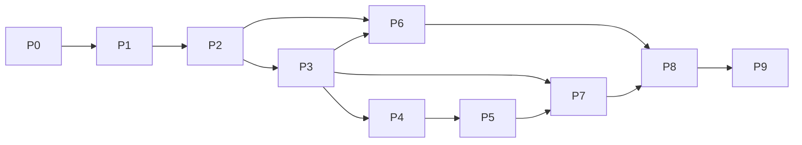

# Roadmap

Local-only through Phase 8. Azure deployment and go-live in Phase 9.

| Phase | Name | Goal | Exit journeys | Relative size |
|---|---|---|---|---|
| 0 | Foundations | Scaffold, dev env, quality gate, pluggable auth, app shell, design tokens | App boots; dev + easyauth-sim login; `make check` green | ~1 week |
| 1 | Core tasks MVP | Teams, projects, sections, tasks, subtasks, list view, task pane, comments, activity, undo, My Tasks, Home | J1, J2 (partial), J3 | 2–3 weeks |
| 2 | Daily-use parity | Board, calendar, fields, tags, multi-homing, dependencies, realtime, notifications/inbox, attachments, search, importers | J2, J4, J5, J6 | 3–4 weeks |
| 3 | AI layer v1 | Gateway, tools, actions, embeddings, ⌘K NL, Ask Mo, inline AI, status drafts, plan my day, project from brief, evals | J7, J8 | 2–3 weeks |
| 4 | Workflow and intake | Rules (+NL, AI steps), forms (+conversational), templates, approvals, recurring | J9 | 2–3 weeks |
| 5 | Agents v1 | Runtime, agents as teammates, 8 starter agents, runs UI, budgets, autonomy | J10 | 3–4 weeks |
| 6 | Planning and insight | Timeline, overview, portfolios, goals, workload, dashboards, forecasting | Phase-6 journeys | 3–4 weeks |
| 7 | Integrations | MCP server, Slack, Outlook calendar, email-to-task | Slack create-task + digest | 2–3 weeks |
| 8 | Hardening | PWA, performance, export/import, security review, a11y, admin | Perf + a11y checks | 1–2 weeks |
| 9 | Azure and go-live | Adapters, Bicep, Easy Auth, pipeline, office LiteLLM check, import real data | Go-live checklist | 1–2 weeks |

## Dependency graph

Phase 9 can be pulled forward after Phase 2 or 3 if the team needs Momentum sooner. Everything Azure-specific is already behind interfaces.

## Milestones

| Milestone | After | Meaning |
|---|---|---|
| M1 "Dogfood" | Phase 1 | You can run your own work in Momentum locally |
| M2 "Parity" | Phase 2 | Feature-complete replacement for how the team uses Asana |
| M3 "Mo" | Phase 3 | AI features working against real LiteLLM |
| M4 "Teammates" | Phase 5 | Agents doing recurring work |
| M5 "Go-live" | Phase 9 | Team using it in the office environment |
