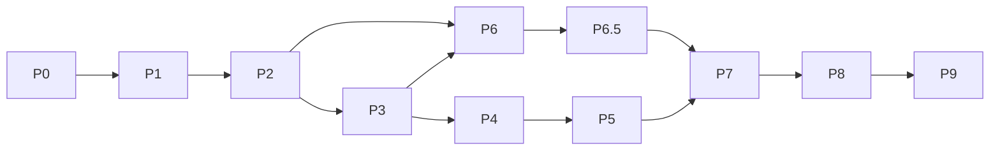

# Roadmap

Local-only through Phase 7. Azure deployment and go-live in Phase 8; integrations after go-live (Phase 9).

> **Re-planned 2026-10-01 (product owner):** Momentum will serve ~150 people in one workspace, many moving off Asana, so hardening comes before go-live and integrations come after it. Phases were renumbered: **old 8 Hardening → 7 (expanded: Hardening and Asana-ready), old 9 Azure → 8, old 7 Integrations → 9**. Older documents (kickoffs, ADRs, the handoff archive, the STATUS plan-changes log) keep the old numbers. Design: `docs/superpowers/specs/2026-10-01-phase-7-hardening-design.md`.

| Phase | Name | Goal | Exit journeys | Relative size |
|---|---|---|---|---|
| 0 | Foundations | Scaffold, dev env, quality gate, pluggable auth, app shell, design tokens | App boots; dev + easyauth-sim login; `make check` green | ~1 week |
| 1 | Core tasks MVP | Teams, projects, sections, tasks, subtasks, list view, task pane, comments, activity, undo, My Tasks, Home | J1, J2 (partial), J3 | 2–3 weeks |
| 2 | Daily-use parity | Board, calendar, fields, tags, multi-homing, dependencies, realtime, notifications/inbox, attachments, search, importers | J2, J4, J5, J6 | 3–4 weeks |
| 3 | AI layer v1 | Gateway, tools, actions, embeddings, ⌘K NL, Ask Mo, inline AI, status drafts, plan my day, project from brief, evals | J7, J8 | 2–3 weeks |
| 4 | Workflow and intake | Rules (+NL, AI steps), forms (+conversational), templates, approvals, recurring | J9 | 2–3 weeks |
| 5 | Agents v1 | Runtime, agents as teammates, 8 starter agents, runs UI, budgets, autonomy | J10 | 3–4 weeks |
| 6 | Planning and insight | Timeline, overview, portfolios, goals, workload, dashboards, forecasting | Phase-6 journeys | 3–4 weeks |
| 6.5 | UI/UX revamp | Light theme redesign (Wayfinding), shell that fits scaled laptops, task list and pane, every screen to the Linear / Height bar (added 2026-10-01 by the product owner) | Visual audit at 5 viewports × 2 themes, axe, e2e | 1–2 weeks |
| 7 | Hardening and Asana-ready | Audit-first edge-case register (zero open P0/P1), 150-user scale, AI/agent hardening, custom-field reporting, full Asana import, security, a11y, export/import, admin | Register clean, 150-user load test, journeys incl. Asana import, live evals | 3–4 weeks |
| 8 | Azure and go-live | Adapters, Bicep, Easy Auth, pipeline, office LiteLLM check, mail relay, import real data | Go-live checklist | 1–2 weeks |
| 9 | Integrations (after go-live) | Slack first; then Outlook calendar, email-to-task, outgoing webhooks on demand | Slack create-task + digest | 2–3 weeks |

## Dependency graph

```mermaid
flowchart LR
  P0 --> P1 --> P2 --> P3 --> P4 --> P5
  P2 --> P6
  P3 --> P6
  P6 --> P65[P6.5]
  P65 --> P7
  P5 --> P7
  P7 --> P8 --> P9
```

Phase 8 can be pulled forward after Phase 2 or 3 if the team needs Momentum sooner. Everything Azure-specific is already behind interfaces.

## Milestones

| Milestone | After | Meaning |
|---|---|---|
| M1 "Dogfood" | Phase 1 | You can run your own work in Momentum locally |
| M2 "Parity" | Phase 2 | Feature-complete replacement for how the team uses Asana |
| M3 "Mo" | Phase 3 | AI features working against real LiteLLM |
| M4 "Teammates" | Phase 5 | Agents doing recurring work |
| M5 "Go-live" | Phase 8 | Team using it in the office environment |
